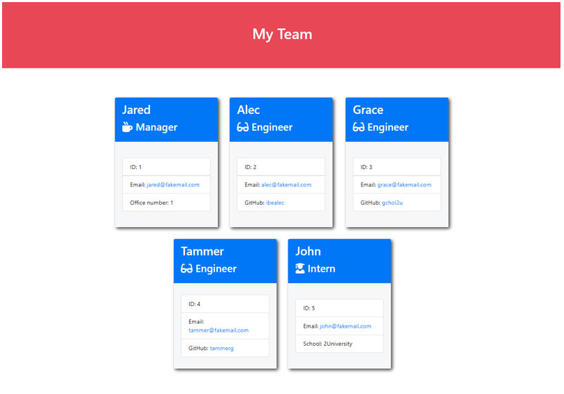

# Team-Generator

## User Story

 

AS A manager
I WANT to generate a webpage that displays my team's basic info
SO THAT I have quick access to their emails and GitHub profiles

# Acceptance Criteria

GIVEN a command-line application that accepts user input
 

<ul>
<li>WHEN I am prompted for my team members and their information</li>
<li>THEN an HTML file is generated that displays a nicely formatted team roster based on user input</li>
<li>WHEN I click on an email address in the HTML</li>
<li>THEN my default email program opens and populates the TO field of the email with the address</li>
<li>WHEN I click on the GitHub username</li>
<li>THEN that GitHub profile opens in a new tab</li>
<li>WHEN I start the application</li>
<li>THEN I am prompted to enter the team manager's name, employee ID, email address, and office number</li>
<li>WHEN I enter the team manager's name, employee ID, email address, and office number</li>
<li>THEN I am presented with a menu with the option to add an engineer or an intern or to finish building my team</li>
<li>WHEN I select the intern option</li>
<li>THEN I am prompted to enter the intern's name, ID, email, and school, and I am taken back to the menu</li>
<li>WHEN I decide to finish building my team</li>
<li>THEN I exit the application, and the HTML is generated</li>
</ul>

[Video Tutorial](https://placeholder)

Contribution guidelines for this project

